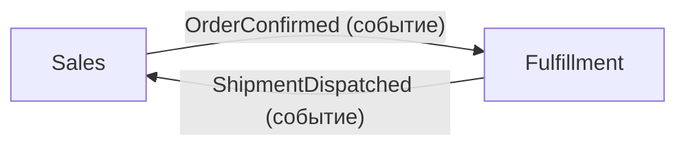

# Ограниченные контексты {{PROJECT_NAME}}

Карта контекстов: кто за что отвечает, как они общаются и чего им знать
**запрещено**. Контекст = граница применимости языка из [glossary.md](glossary.md):
один термин в разных контекстах может значить разное — это нормально и
фиксируется в глоссарии отдельными строками.

## Контексты

| Контекст | Ответственность | Модуль в коде | Владелец |
|---|---|---|---|
| Sales *(Пример — замените своим)* | Оформление и жизненный цикл заказов, цены на момент покупки | `src/contexts/sales/` | TODO(template) |
| Fulfillment *(Пример — замените своим)* | Комплектация, отгрузки, взаимодействие со службами доставки | `src/contexts/fulfillment/` | TODO(template) |
| TODO(template): контексты вашего проекта | | | |

Если проект — монолит без выделенных контекстов, зафиксируй это явно одной
строкой («единый контекст, кандидаты на выделение: …») — пустая таблица хуже.

## Карта интеграций

Каждая связь между контекстами — явная: событие, синхронный вызов API или
общая читаемая модель. Неявных связей (прямой импорт чужих внутренних классов,
чтение чужих таблиц) быть не должно.

| Откуда → Куда | Механизм | Контракт | Что передаётся |
|---|---|---|---|
| Sales → Fulfillment *(Пример — замените своим)* | Событие `OrderConfirmed` | `src/contexts/sales/events.py` | id заказа, состав, адрес доставки |
| Fulfillment → Sales *(Пример — замените своим)* | Событие `ShipmentDispatched` | `src/contexts/fulfillment/events.py` | id заказа, id отгрузки, дата |
| TODO(template): интеграции вашего проекта | | | |

Заготовка карты (замените на реальную):

## Что контексту знать запрещено

Запреты — главное содержимое этого файла: они защищают границы при рефакторингах.
Направление зависимостей внутри контекста — [../architecture/overview.md](../architecture/overview.md).

| Контекст | Запрещено |
|---|---|
| Sales *(Пример — замените своим)* | Внутренняя модель складов и маршрутов Fulfillment; знает только факт и дату отгрузки из событий |
| Fulfillment *(Пример — замените своим)* | Цены, скидки и платёжные данные; получает состав заказа без денежных полей |
| TODO(template): запреты для ваших контекстов | |

## Чек-лист при изменении границ

- [ ] Новый контекст добавлен во все три таблицы и на карту?
- [ ] Для каждой новой связи указан контракт (файл со схемой события/API)?
- [ ] Не появился ли прямой импорт внутренних классов чужого контекста?
      (Общие термины — через глоссарий, общие данные — через контракт.)
- [ ] Перенос сущности между контекстами отражён в
      [domain-model.md](domain-model.md) и [glossary.md](glossary.md)?
- [ ] Решение о выделении/слиянии контекстов оформлено как ADR
      ([../decisions/README.md](../decisions/README.md))?
