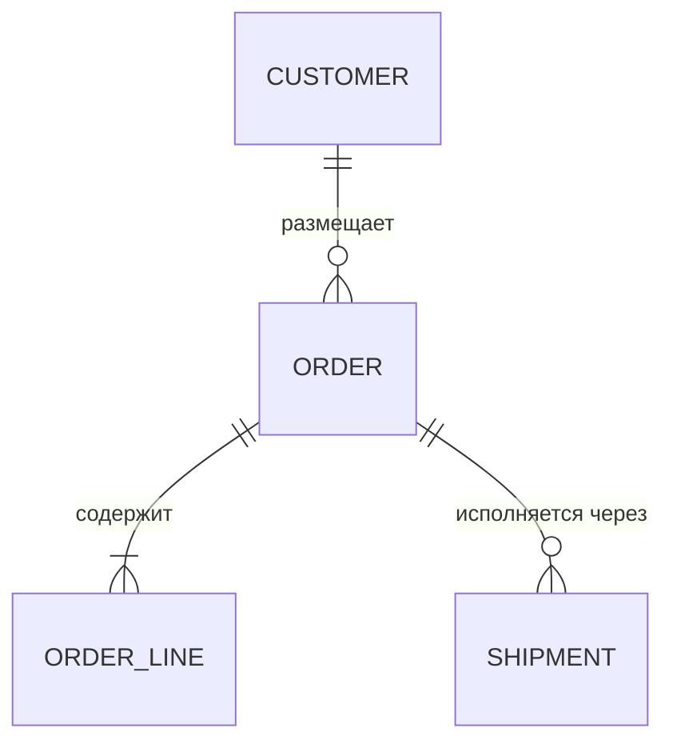
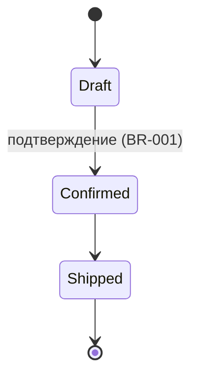

# Доменная модель {{PROJECT_NAME}}

Сущности, агрегаты и их инварианты. Имена — строго из [glossary.md](glossary.md).
Где эти классы лежат по слоям — [../architecture/overview.md](../architecture/overview.md);
принятые тактические паттерны (Entity, Value Object, Repository) —
[../architecture/patterns.md](../architecture/patterns.md).

## Сущности и агрегаты

Колонка «Где в коде» — путь к модулю/классу в репозитории; проверяется при сверке
с кодом (`verified_commit`, см. [../_meta/lifecycle.md](../_meta/lifecycle.md)).

| Сущность | Роль | Назначение | Ключевые инварианты | Где в коде |
|---|---|---|---|---|
| Order *(Пример — замените своим)* | Корень агрегата | Жизненный цикл покупки от оформления до закрытия | Сумма = Σ строк; ≥1 строка у подтверждённого заказа; переходы статусов только по схеме ниже | `src/domain/sales/order.py` |
| OrderLine *(Пример — замените своим)* | Внутри агрегата Order | Позиция заказа с зафиксированной ценой | Количество > 0; цена фиксируется при создании и не меняется | `src/domain/sales/order.py` |
| Customer *(Пример — замените своим)* | Корень агрегата | Покупатель и его контактные данные | Email уникален и валиден | `src/domain/customers/customer.py` |
| TODO(template): сущности вашего домена | | | | |

## Отношения

Заготовка диаграммы (замените на реальную модель):

Если у сущности есть жизненный цикл статусов — добавьте stateDiagram:

## Правила целостности

- Границы агрегата = граница транзакции: один агрегат изменяется в одной транзакции;
  между агрегатами — согласованность в конечном счёте (события/саги).
- Ссылки между агрегатами — только по идентификатору, не по объектной ссылке.
- Инварианты агрегата проверяются внутри агрегата (домен-слой), а не в use case,
  контроллере или БД-триггере. Каждый инвариант из таблицы покрыт unit-тестом
  (см. [../architecture/testing-strategy.md](../architecture/testing-strategy.md)).
- Инвариант, который проще сформулировать как правило поведения
  («нельзя X после Y»), регистрируется в [business-rules.md](business-rules.md)
  и здесь упоминается по номеру (BR-XXX).

## Чек-лист при изменении модели

- [ ] Новая сущность есть в [glossary.md](glossary.md)? Имя в коде совпадает?
- [ ] Определён корень агрегата и что входит в его границу?
- [ ] Инварианты записаны в таблицу и покрыты тестами?
- [ ] Диаграммы выше обновлены?
- [ ] Затронуты границы контекстов ([bounded-contexts.md](bounded-contexts.md))?
      Если сущность «понадобилась» второму контексту — это сигнал к обсуждению,
      а не к прямому импорту.
- [ ] Существенное решение по модели (разбиение агрегата, смена границ) —
      оформлено как ADR ([../decisions/README.md](../decisions/README.md))?
